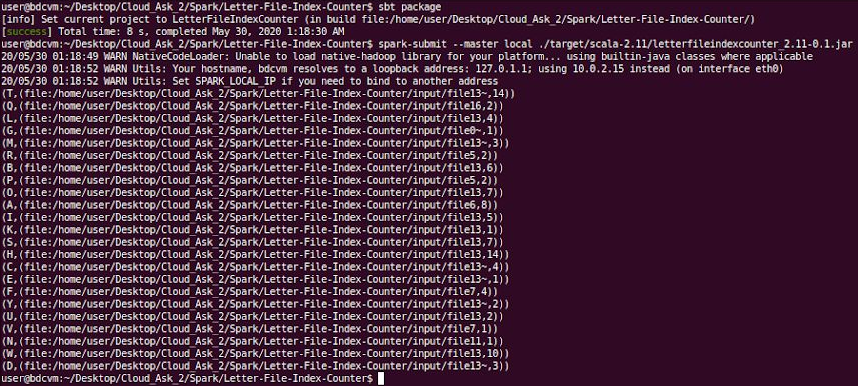

# Spark-Letter-File-Index-Counter
A Spark-based Scala project that counts the max number of word occurences for each letter in a textfile of a folder.

We basically need for every letter of the alphabet to retrieve the maximum number of words beginning with this given letter, along with the file that these words are located. So in fact we have a case of a **wordcount** problem with a distributed file system twist.

### Project Description
_(using RDD tuples)_

* The text from all the files under the `input` directory gets loaded in memory.
* Key-value pairs are created with the name of each file as key and the content (text) of this given file as value like _`(filename, text)`_
* The text from each file gets splitted into words and hold the first character of every word
* Words are mapped in pairs, were each initial letter is in a composite key along with the name of the file that its contents are being scanned at the moment. Temporary initial value of the pair is _1_ (since we know for sure that at least one word begins with this letter it this file).
* The pairs reduced by key so that we have the sum of the word occurences for an initial letter within each file like _`((letter, filename), sum_of_occurences)`_
* The previous results are mapped once again in a key-value pair so that the letter is the key of the pair like _`(letter, (filename, sum_of_occurences))`_
* The pairs get reduced by the maximum of the occurency sums, so for each letter we have the maximum number of word occurences and the file with the most word occurences

### Final results example

### Project Info
* All the input files are located in the `input` directory with 20 files that contain a small phrase from Metamorphosis by Franz Kafka
* The `input` directory is given in full path format, so you need to change that accordingly for your machine
* Final results get presented as output when the execution is over, without being stored anywhere
* Also check out the 
